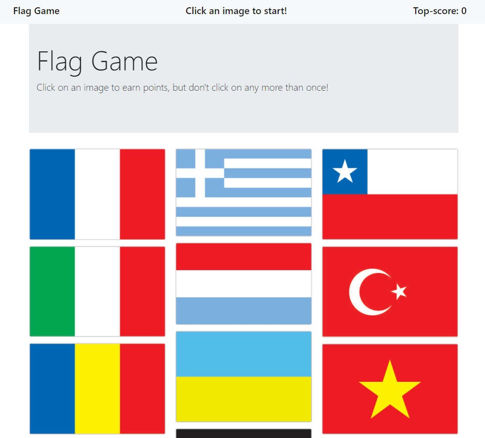

# Flag Game
Project for UC Berkeley coding Bootcamp

[](https://opensource.org/licenses/MIT)



## Technologies Used
- HTML
- CSS
- JavaScript
- [React](https://reactjs.org/)
- [Node.js](https://nodejs.org/en/)
- [npm](https://www.npmjs.com/) packages
    - [express](https://www.npmjs.com/package/express)
    - [Animate.css](https://animate.style/)
    - [React-dom](https://www.npmjs.com/package/react-dom)


## Summary 
In this game, you need to Click on an image to earn points, the images are then shuffled and if you click the same image twice, you will lose the game.

## How to install
```
npm install
```


## How to use it

run the commande 

```
npm start then browse http://localhost:3000
```

## Code Snippet  
```Javascript 
    db.Workout.aggregate([{
        $addFields: {
            totalDuration: {
                $sum: "$exercises.duration"
            }
        }
    }]).sort({ day: -1 })
        .limit(7)
        .then(workout => {
            res.json(workout)
        })
        .catch(err => {
            res.json(err);
        })
```
The Mongoose aggregate method allow us to pull data from multiple rows and group it's data.

## Deployed Link

[See Live Site](https://fitness-tracker-dc.herokuapp.com/)


## Author Links
[LinkedIn](https://www.linkedin.com/in/dcouzon/)
[GitHub](https://github.com/Dylancouzon)
